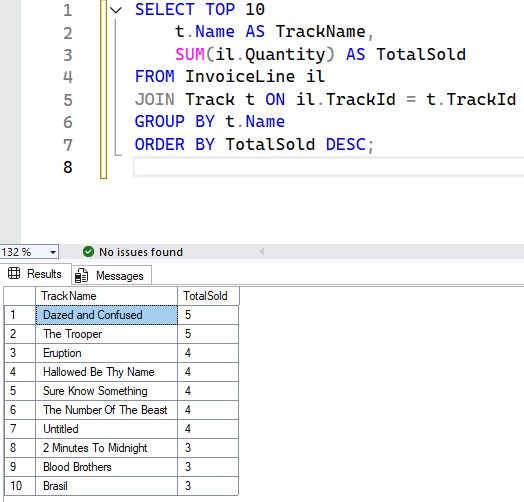
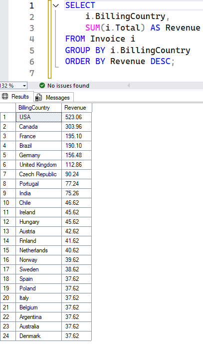
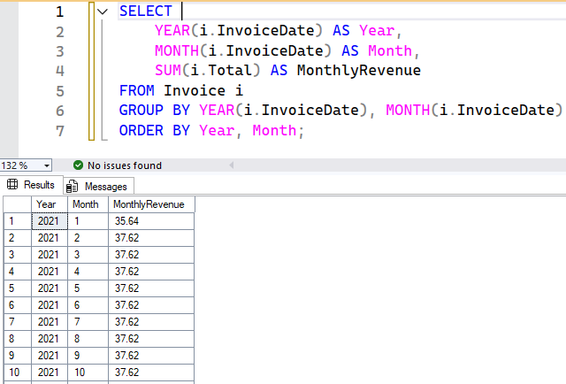
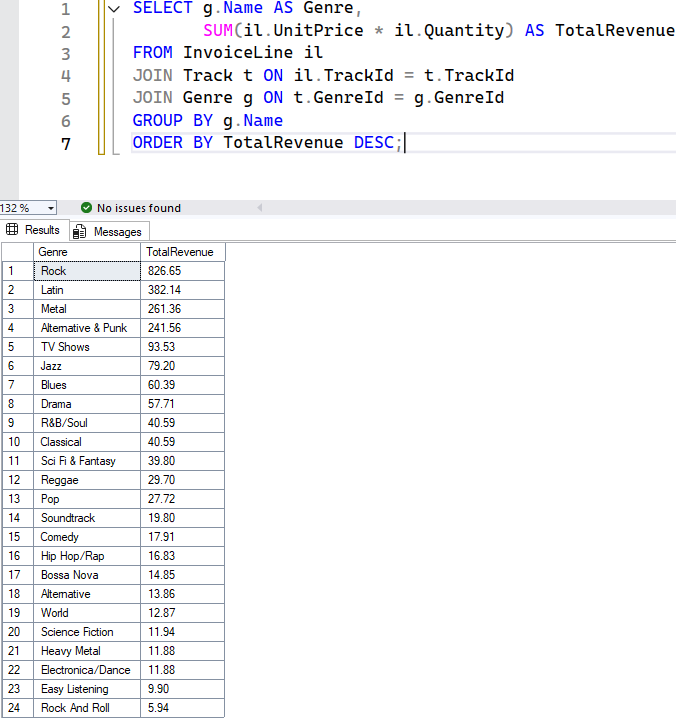
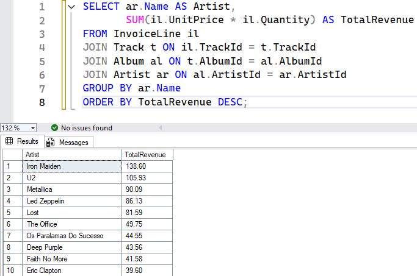
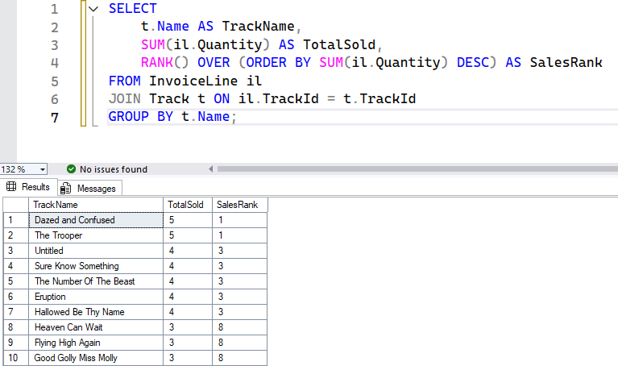

# SQL Sales Analysis – Chinook Database

## 📌 Project Overview
This project analyzes product sales and customer behavior using the **Chinook Database**, a sample database representing a digital music store.  
The focus is on writing **SQL queries** to extract business insights such as top-selling products, revenue by region, monthly trends, and more.  

Tools Used:
- Microsoft SQL Server
- SQL (with JOINs, aggregations, and window functions)
- CSV exports + query result screenshots

---

## 📂 Repository Contents
- `Chinook_SqlServer.sql` → SQL script to create & populate the Chinook database  
- `chinook_analysis_queries.sql` → All queries used for the analysis  
- `.csv` files → Query outputs saved as CSV  
- `.png` files → Screenshots of queries and results  

---

## 🔍 Queries and Insights

### **Query 1 – Top-Selling Tracks**
Finds the top 10 tracks by total sales (revenue).  
📸 Screenshot:  
  

**Insight:**  
These are the tracks generating the highest revenue, showing which individual songs perform best commercially.  

---

### **Query 2 – Revenue by Country**
Shows the revenue contribution of each country.  
📸 Screenshot:  
  

**Insight:**  
Revenue is concentrated in certain countries, highlighting the strongest markets for digital music sales.  

---

### **Query 3 – Monthly Revenue Trend**
Analyzes revenue over time (by year-month).  
📸 Screenshot:  
  

**Insight:**  
Reveals revenue trends over months and years, useful for identifying seasonality or growth patterns.  

---

### **Query 4 – Revenue by Genre**
Shows which music genres generate the most revenue.  
📸 Screenshot:  
  

**Insight:**  
Genres differ significantly in profitability, suggesting where to invest in content or promotion.  

---

### **Query 5 – Top-Selling Artists**
Highlights the most profitable artists based on sales.  
📸 Screenshot:  
  

**Insight:**  
Top artists dominate sales, and focusing on their catalogs could maximize future revenue.  

---

### **Bonus Query – Ranking Customers by Revenue**
Uses a window function to rank customers by total revenue.  
📸 Screenshot:  
  

**Insight:**  
Helps identify high-value customers (VIPs), useful for loyalty programs or targeted marketing.  

---

## 📊 Key Takeaways
- Certain genres and artists drive a disproportionate share of revenue.  
- Revenue is concentrated in specific countries/regions.  
- Monthly revenue trends show seasonal or time-based purchasing behavior.  
- Window functions provide deeper business insights, such as ranking customers by revenue.  

---

## ✅ How to Run
1. Import `Chinook_SqlServer.sql` into SQL Server (or the corresponding file for another DB engine).  
2. Open `chinook_analysis_queries.sql` and run the queries.  
3. Compare your results with the included CSV outputs and screenshots.  

---

## 📜 License
This project uses the Chinook Database, licensed under [MIT License](https://github.com/lerocha/chinook-database/blob/master/LICENSE.md).
